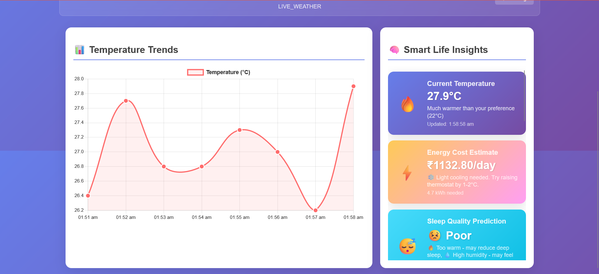

# Smart Life Weather Dashboard

<p align="center">
  
  
  
  
</p>

An interactive, real-time weather dashboard that provides current weather conditions and offers **smart life suggestions** based on the data. This application is built using vanilla HTML, CSS, and JavaScript, and integrates with the OpenWeatherMap API to fetch live weather information.

---

## ✨ Features

- **Real-Time Weather Data**: Displays current temperature, conditions, humidity, and wind speed from OpenWeatherMap API.
- **Location-Based Search**: Enter any city name to get instant weather updates.
- **Smart Life Suggestions**: Personalized tips based on weather data, including:
  - Energy cost predictions
  - Sleep quality analysis
  - Plant care tips
  - Pet comfort alerts
- **Data Visualization**: Displays a live temperature trend graph using Chart.js.
- **Persistent User Settings**: Uses `localStorage` to save recent cities and preferences.
- **Responsive Design**: Optimized for all device sizes and screen types.

---

## 📸 Screenshots



---

## 🛠️ Tech Stack

- **Frontend**: HTML5, CSS3, JavaScript (ES6+)
- **API**: [OpenWeatherMap API](https://openweathermap.org/api)
- **Data Visualization**: [Chart.js](https://www.chartjs.org/)

---

## 🚀 Setup and Installation

### 1. Clone the repository:
```bash
git clone https://github.com/patrapritam/Weather_app.git
